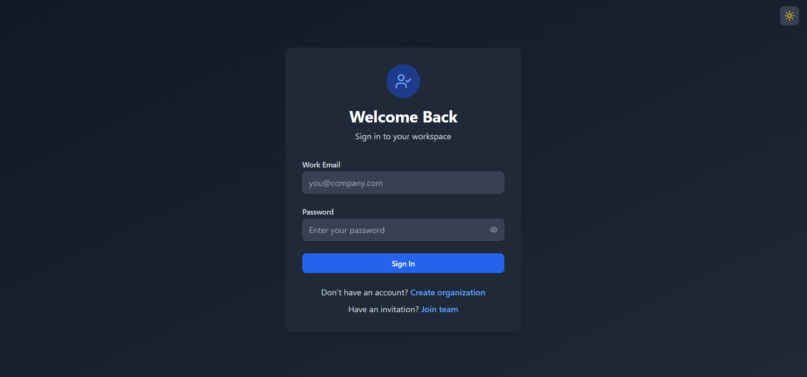
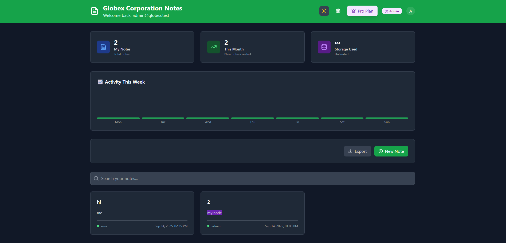

<div align="center">

# **Multi-Tenant Notes SaaS**

A secure, full-stack, multi-tenant notes application built with React, Node.js, and PostgreSQL. This project demonstrates a scalable SaaS architecture where each user's data is completely isolated.


</div>

---

### **✨ Live Demo**

* **Frontend Deployed on Vercel:** [**my-notes-app-frontend-ten.vercel.app**](https://my-notes-app-frontend-ten.vercel.app/)
* **Backend API Status:** [**my-notes-app-backend-zeta.vercel.app**](https://my-notes-app-backend-zeta.vercel.app/)

---

### **📸 Screenshots**

| Login & Authentication                      | Main Notes Dashboard                        |
| :------------------------------------------: | :-------------------------------------------: |
| ** | ** |

---

### **🚀 Core Features**

* **🔐 Secure JWT Authentication:** Stateless and secure user authentication using JSON Web Tokens.
* **🏢 True Multi-Tenancy:** A robust architecture ensuring each user's (tenant's) data is strictly isolated at the database level using foreign key constraints.
* **✍️ Full CRUD Functionality:** Users can seamlessly Create, Read, Update, and Delete their notes.
* **📱 Responsive UI/UX:** A clean and modern user interface built with Vite + React and styled with Tailwind CSS for a great experience on any device.
* **🚄 Type-Safe Backend:** A powerful RESTful API built with Node.js and Express, leveraging Prisma ORM for type-safe database interactions with a PostgreSQL database.

---

### **💡 Technology Choices & Architecture**

This project was built with a modern, scalable tech stack, prioritizing developer experience and type safety.

* **Frontend:** **Vite + React** was chosen for its blazing-fast development server and optimized build process. **Tailwind CSS** provides a utility-first approach to styling, enabling rapid UI development.
* **Backend:** **Express.js** offers a minimalist and flexible foundation for the API. **Prisma** was selected as the ORM to bridge the application with the PostgreSQL database, providing incredible autocompletion and ensuring all database queries are type-safe, which drastically reduces runtime errors.
* **Database:** A **PostgreSQL** database hosted on **Neon** was used for its reliability and robust feature set suitable for relational data.
* **Deployment:** The entire application (both frontend and backend services) is deployed on **Vercel** for its seamless Git integration, automatic deployments, and serverless function support.

---

### **⚙️ Getting Started Locally**

To get a local copy up and running, please follow these simple steps.

#### **Prerequisites**

* Node.js (v18.x or later)
* Git

#### **Installation & Setup**

1.  **Clone the repo**
    ```sh
    git clone [https://github.com/user-aditi/multi-tenant-notes-saas.git](https://github.com/user-aditi/multi-tenant-notes-saas.git)
    cd multi-tenant-notes-saas
    ```

2.  **Backend Setup**
    ```sh
    cd backend
    npm install
    # Create a .env file based on .env.example
    cp .env.example .env
    # Add your database URL and other secrets to the new .env file
    npx prisma migrate dev
    npm run dev
    ```

3.  **Frontend Setup**
    ```sh
    cd frontend
    npm install
    # Create a .env file based on .env.example
    cp .env.example .env
    npm run dev
    ```

---

### **🔌 API Endpoints**

All protected routes require an `Authorization: Bearer <token>` header.

| Method   | Endpoint             | Protection | Description                      |
| :------- | :------------------- | :--------- | :------------------------------- |
| `POST`   | `/api/auth/register` | Public     | Registers a new user.            |
| `POST`   | `/api/auth/login`    | Public     | Logs in a user and returns a JWT.|
| `GET`    | `/api/notes`         | Protected  | Fetches all notes for the authenticated user. |
| `POST`   | `/api/notes`         | Protected  | Creates a new note for the authenticated user. |
| `PUT`    | `/api/notes/:id`     | Protected  | Updates a specific note by its ID. |
| `DELETE` | `/api/notes/:id`     | Protected  | Deletes a specific note by its ID. |

---

### **🤝 Contributing**

Contributions are what make the open-source community such an amazing place to learn, inspire, and create. Any contributions you make are **greatly appreciated**.

Please see the `CONTRIBUTING.md` file for details on our code of conduct and the process for submitting pull requests.

---

### **📜 License**

Distributed under the MIT License. See `LICENSE` for more information.

---

### **👤 Author**

* **Aditi**
* GitHub: [@user-aditi](https://github.com/user-aditi)